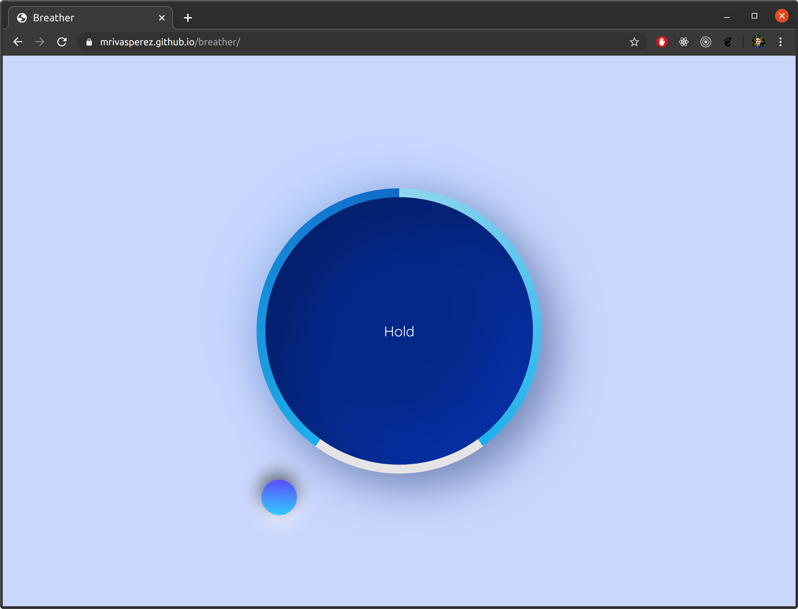

# breather: a simple breathing exercise app.
by mrivasperez [live demo](https://mrivasperez.github.io/breather/) 

## About
Breather is a simple application built with ES6, CSS, and HTML using a very minimal, calm ui. It is designed to help with daily relaxation and breath training. 

## Screenshot
